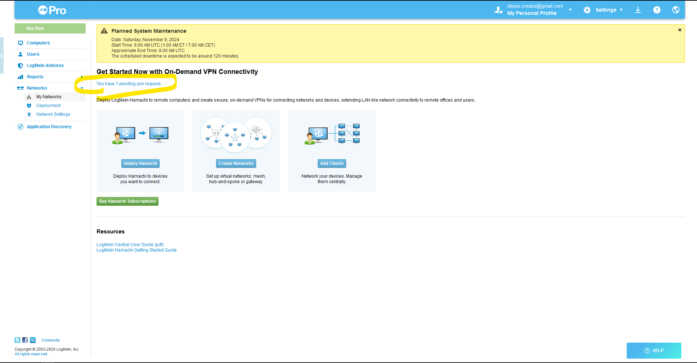
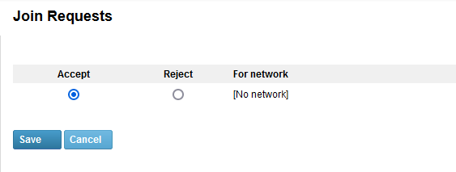

# Instalação e Configuração do Hamachi

## Passo 1: Criar uma Conta no Hamachi
1. Acesse o seguinte link para criar sua conta Hamachi:
   [Crie uma conta no Hamachi](https://secure.logmein.com/welcome/hamachi/vpn/default.aspx)
   
2. Após o cadastro, guarde o e-mail que você usou para se registrar.

---

## Passo 2: Tornar os Scripts Executáveis
Para permitir que os scripts sejam executáveis, use os seguintes comandos:

```bash
chmod +x install.sh
chmod +x connect_all.sh
```

---

## Passo 3: Executar o Script de Instalação
Rode o script de instalação para configurar o Hamachi:

```bash
./install.sh
```

Durante a instalação, será solicitado o e-mail que você utilizou para se registrar no Hamachi.

---

## Passo 4: Aceitar o Pedido no Dashboard
1. Acesse o painel de controle do Hamachi em:
   [Hamachi Dashboard](https://secure.logmein.com/central/Central.aspx)

2. Na dashboard, você verá um pedido. Aceite e salve o pedido.
   
   
   

---

## Passo 5: Conectar-se às Redes

O Hamachi possui um limite de 5 membros por rede, então foram criadas **cinco redes diferentes**.

Toda vez que você tentar se conectar a uma rede, o Hamachi solicitará uma senha.

### Copiar a Senha

Copie a senha do arquivo `password.txt`.

```bash
./connect_all.sh
```

---

## Problemas de Conexão

Se você não conseguir se conectar a alguma rede, pode ser que a rede esteja ocupada. Por exemplo, você verá a mensagem:

```
Joining OsGGs-05-iBH7B .. failed, busy
```

Nesse caso, rode novamente o script:

```bash
./connect_all.sh
```

---

## Acessando o IP do servidor
O endereço **IPv4** de um membro na rede Hamachi pode ser acessado por qualquer outra conta que esteja na **mesma sala** do Hamachi.

Para entrar no mundo ficaria:

Server name:
    Minecraft Server
Server Address:
    22.42.133.203# configurar-hamachi
# configurar-hamachi
